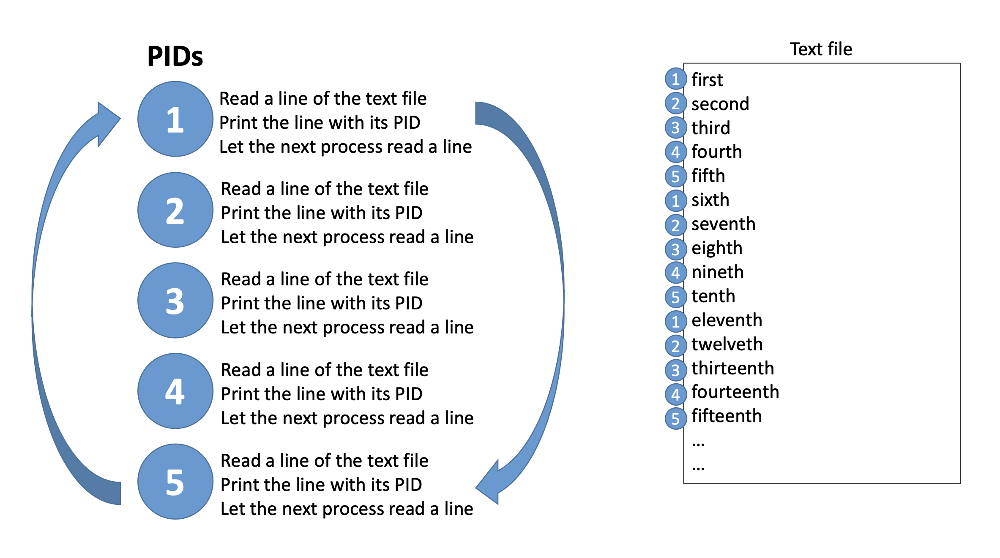

# Third & Bonus Assignment
## Goal
- In this programming assignment, we will design our own core input and output functions of the C standard I/O library.  
- The goal is to implement C I/O functions by using UNIX I/O functions
- 
## Requirements
### Implement for Third Assigment
- fopen: opens a file  
- fread: reads from a file
- fwrite: writes to a file
- fflush: synchronizes a stream with an actual file
- fseek: moves the file position to a specific location in a file
- feof: check for the end-of-file 7.fclose: closes a file

### Implement for Bonus Assigment
- A basic multi-process program using functions that you make on thrid assignment  

- Your program MUST take a path of a text file as an argument. thus, you should run your program like -> /yourprogram path-to-textfile
